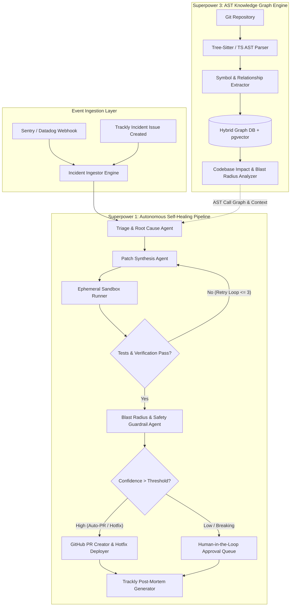
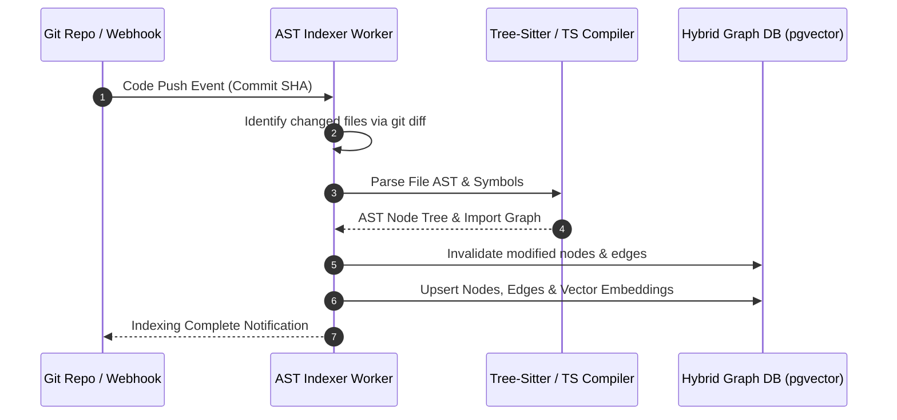
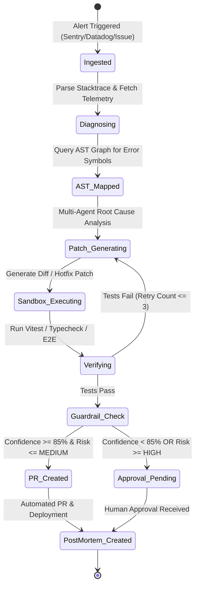
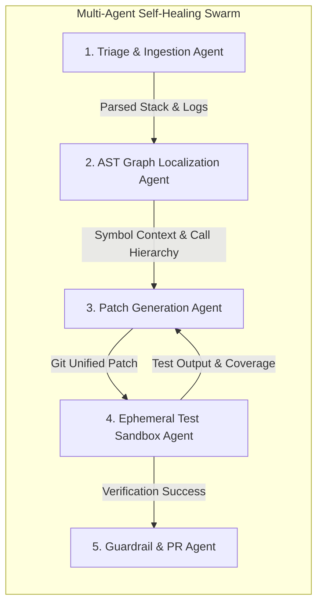

# Trackly — Superpowers 1 & 3 Detailed Architectural Specification

**Date:** 2026-07-28  
**Status:** Approved  
**Author:** AIArchitect (Principal AI Research & Knowledge Graph Engineer)  
**Target Systems:** 
- **Superpower 1:** Autonomous AI Incident Self-Healing Pipeline
- **Superpower 3:** Codebase AST Knowledge Graph Engine & Impact Analyzer

---

## 1. Executive Summary & High-Level Architecture

Trackly Superpower 1 and Superpower 3 combine to form an autonomous software maintenance and incident remediation ecosystem. 

- **Superpower 3 (Codebase AST Knowledge Graph Engine)** acts as the cognitive map of the repository. It performs AST parsing (TypeScript Compiler API, Tree-Sitter) to extract symbols, dependencies, function call graphs, API route handlers, and database models into a hybrid Graph-Vector database (`pgvector` / Neo4j + embeddings).
- **Superpower 1 (Autonomous AI Incident Self-Healing Pipeline)** ingests error alerts (Sentry webhooks, Datadog alerts, or Trackly incident issues), queries Superpower 3 to map stack traces to AST call graphs and compute blast radius, orchestrates multi-agent diagnosis and code patch synthesis, executes isolated regression verification, and automatically submits hotfix PRs and Trackly post-mortem tickets.



---

## 2. Superpower 3: Codebase AST Knowledge Graph Engine

### 2.1 Engine Architecture & Indexing Workflow

The AST Knowledge Graph Engine transforms raw source code into a queryable semantic graph:

1. **AST Extraction**:
   - Parses TypeScript/JavaScript via `@typescript/vfs` & Tree-Sitter bindings.
   - Extracts top-level and nested AST Nodes: `FILE`, `CLASS`, `FUNCTION`, `METHOD`, `INTERFACE`, `TYPE_ALIAS`, `ROUTE_HANDLER`, `PRISMA_MODEL`, `EXPORT`, `IMPORT`.
   - Stores exact code line ranges (`startLine`, `endLine`, `startCol`, `endCol`).
2. **Graph Linkage**:
   - Resolves cross-file symbol references, import aliases (`@/lib/...`), function call targets, variable bindings, and route endpoints.
   - Constructs directed edges: `CALLS`, `IMPORTS`, `EXTENDS`, `IMPLEMENTS`, `EXPOSES_ENDPOINT`, `MUTATES_MODEL`, `TESTED_BY`.
3. **Vector Embedding Layer**:
   - Generates 1536-dimensional embeddings (`text-embedding-3-small`) for docstrings, function bodies, type definitions, and commit context.
4. **Incremental Graph Maintenance**:
   - Listens to Git webhooks / file-watcher events (`push`, `pull_request`). Parses only modified files, invalidates affected graph nodes, and updates downstream edge relationships.



---

### 2.2 Database Models & Schemas

#### Prisma Schema Extensions (`prisma/schema.prisma`)

```prisma
enum ASTNodeType {
  FILE
  CLASS
  INTERFACE
  TYPE_ALIAS
  FUNCTION
  METHOD
  VARIABLE
  ROUTE_HANDLER
  PRISMA_MODEL
  COMPONENT
}

enum ASTEdgeType {
  IMPORTS
  EXPORTS
  CALLS
  EXTENDS
  IMPLEMENTS
  EXPOSES_ENDPOINT
  MUTATES_MODEL
  TESTED_BY
  DEPENDS_ON
}

model ASTNode {
  id              String         @id @default(cuid())
  workspaceId     String
  repositoryId    String
  filePath        String
  nodeType        ASTNodeType
  name            String
  qualifiedName   String         // e.g. "app/api/issues/route.ts#POST"
  signature       String?        // e.g. "(req: Request) => Promise<Response>"
  startLine       Int
  endLine         Int
  startColumn     Int
  endColumn       Int
  docstring       String?
  sourceHash      String         // SHA256 of node snippet
  embedding       Unsupported("vector(1536)")?
  createdAt       DateTime       @default(now())
  updatedAt       DateTime       @updatedAt

  outgoingEdges   ASTEdge[]      @relation("SourceNode")
  incomingEdges   ASTEdge[]      @relation("TargetNode")
  impactAnalyses  ImpactAnalysisNode[]

  @@unique([repositoryId, qualifiedName])
  @@index([filePath])
  @@index([nodeType])
}

model ASTEdge {
  id            String      @id @default(cuid())
  repositoryId  String
  sourceNodeId  String
  targetNodeId  String
  edgeType      ASTEdgeType
  weight        Float       @default(1.0)
  metadata      Json?       // e.g., call frequency, async invocation, conditional path

  sourceNode    ASTNode     @relation("SourceNode", fields: [sourceNodeId], references: [id], onDelete: Cascade)
  targetNode    ASTNode     @relation("TargetNode", fields: [targetNodeId], references: [id], onDelete: Cascade)

  @@unique([sourceNodeId, targetNodeId, edgeType])
  @@index([sourceNodeId])
  @@index([targetNodeId])
}

model RepositoryGraphMeta {
  id            String   @id @default(cuid())
  repositoryId  String   @unique
  commitSha     String
  totalNodes    Int
  totalEdges    Int
  indexedAt     DateTime @default(now())
  status        String   // "INDEXING" | "READY" | "FAILED"
}
```

---

### 2.3 AST Knowledge Graph API Schemas & Zod Definitions

#### TypeScript Zod Interfaces (`lib/ast/schemas.ts`)

```typescript
import { z } from "zod";

export const ASTNodeSchema = z.object({
  id: z.string(),
  workspaceId: z.string(),
  repositoryId: z.string(),
  filePath: z.string(),
  nodeType: z.enum([
    "FILE", "CLASS", "INTERFACE", "TYPE_ALIAS",
    "FUNCTION", "METHOD", "VARIABLE", "ROUTE_HANDLER",
    "PRISMA_MODEL", "COMPONENT"
  ]),
  name: z.string(),
  qualifiedName: z.string(),
  signature: z.string().nullable(),
  startLine: z.number().int(),
  endLine: z.number().int(),
  startColumn: z.number().int(),
  endColumn: z.number().int(),
  docstring: z.string().nullable(),
  sourceHash: z.string(),
});

export const ImpactAnalysisRequestSchema = z.object({
  repositoryId: z.string(),
  targetFilePaths: z.array(z.string()),
  targetSymbolNames: z.array(z.string()).optional(),
  maxTraversalDepth: z.number().int().min(1).max(10).default(5),
  includeTests: z.boolean().default(true),
});

export const ImpactAnalysisResponseSchema = z.object({
  analysisId: z.string(),
  repositoryId: z.string(),
  blastRadiusScore: z.number().min(0).max(100), // Risk score 0-100
  affectedFilesCount: z.number().int(),
  affectedSymbolsCount: z.number().int(),
  affectedRoutes: z.array(z.object({
    endpoint: z.string(),
    method: z.string(),
    handlerSymbol: z.string(),
  })),
  affectedModels: z.array(z.string()),
  affectedTests: z.array(z.string()),
  impactTree: z.object({
    directDependents: z.array(z.string()),
    transitiveDependents: z.array(z.string()),
    callChains: z.array(z.array(z.string())),
  }),
  riskCategory: z.enum(["LOW", "MEDIUM", "HIGH", "CRITICAL"]),
});

export type ImpactAnalysisRequest = z.infer<typeof ImpactAnalysisRequestSchema>;
export type ImpactAnalysisResponse = z.infer<typeof ImpactAnalysisResponseSchema>;
```

---

### 2.4 Codebase Impact Analysis Engine Algorithm

When code is modified or proposed by the AI Self-Healing agent, the Impact Analyzer computes the transitive dependency traversal to assess blast radius:

$$\text{BlastRadiusScore} = \min\left(100, \sum_{v \in V_{\text{affected}}} W(v) \cdot d(v)^{-\alpha}\right)$$

Where:
- $V_{\text{affected}}$ is the set of graph nodes reached via downstream traversal of `CALLS`, `MUTATES_MODEL`, `EXPOSES_ENDPOINT` edges.
- $W(v)$ is the node weight ($W(\text{ROUTE})=15$, $W(\text{MODEL})=20$, $W(\text{FUNCTION})=5$, $W(\text{TEST})=1$).
- $d(v)$ is the shortest path distance from modified symbol to node $v$.
- $\alpha$ is the distance attenuation factor (typically $0.75$).

---

## 3. Superpower 1: Autonomous AI Incident Self-Healing Pipeline

### 3.1 Pipeline & Event Ingestion Workflow

The Autonomous AI Incident Self-Healing Pipeline automatically detects, isolates, fixes, verifies, and documents production incidents:



---

### 3.2 Database Models & Schemas

#### Prisma Schema Extensions (`prisma/schema.prisma`)

```prisma
enum IncidentSeverity {
  LOW
  MEDIUM
  HIGH
  CRITICAL
}

enum IncidentStatus {
  OPEN
  TRIAGED
  SELF_HEALING_IN_PROGRESS
  PATCH_GENERATED
  VERIFIED
  PR_OPENED
  RESOLVED
  FAILED_ESCALATED
}

enum HealingStepType {
  TELEMETRY_INGESTION
  AST_CALLGRAPH_LOOKUP
  ROOT_CAUSE_DIAGNOSIS
  PATCH_SYNTHESIS
  SANDBOX_TEST_EXECUTION
  GUARDRAIL_EVALUATION
  PR_CREATION
  POST_MORTEM_GENERATION
}

model Incident {
  id                 String           @id @default(cuid())
  workspaceId        String
  issueId            String?          @unique // Linked Trackly Issue if present
  title              String
  description        String
  severity           IncidentSeverity
  status             IncidentStatus   @default(OPEN)
  source             String           // "SENTRY" | "DATADOG" | "MANUAL" | "TRACKLY_BUG"
  externalAlertId    String?
  stackTrace         String           @db.Text
  errorName          String
  errorMessage       String
  environment        String           @default("production")
  commitSha          String
  createdAt          DateTime         @default(now())
  updatedAt          DateTime         @updatedAt

  telemetry          IncidentTelemetry?
  healingRuns        SelfHealingRun[]
  postMortem         PostMortemReport?

  @@index([status])
  @@index([workspaceId])
}

model IncidentTelemetry {
  id             String    @id @default(cuid())
  incidentId     String    @unique
  affectedUsers  Int       @default(0)
  errorCount     Int       @default(1)
  firstSeenAt    DateTime
  lastSeenAt     DateTime
  rawLogs        Json
  metricSnapshot Json?     // Latency p99, CPU, Memory spike data

  incident       Incident  @relation(fields: [incidentId], references: [id], onDelete: Cascade)
}

model SelfHealingRun {
  id                  String             @id @default(cuid())
  incidentId          String
  attemptNumber       Int                @default(1)
  status              String             // "IN_PROGRESS" | "SUCCESS" | "FAILED" | "WAITING_APPROVAL"
  rootCauseAnalysis   String?            @db.Text
  proposedPatchDiff   String?            @db.Text
  patchConfidence     Float?             // 0.0 - 1.0
  blastRadiusScore    Float?
  pullRequestUrl      String?
  startedAt           DateTime           @default(now())
  completedAt         DateTime?

  incident            Incident           @relation(fields: [incidentId], references: [id], onDelete: Cascade)
  executionSteps      HealingStepLog[]
  verificationResults VerificationResult[]
}

model HealingStepLog {
  id              String          @id @default(cuid())
  healingRunId    String
  stepType        HealingStepType
  status          String          // "RUNNING" | "PASSED" | "FAILED"
  inputPayload    Json?
  outputPayload   Json?
  executionTimeMs Int
  createdAt       DateTime        @default(now())

  healingRun      SelfHealingRun  @relation(fields: [healingRunId], references: [id], onDelete: Cascade)
}

model VerificationResult {
  id              String         @id @default(cuid())
  healingRunId    String
  testSuiteName   String         // "vitest" | "tsc" | "eslint" | "playwright"
  passed          Boolean
  totalTests      Int
  passedTests     Int
  failedTests     Int
  outputLogs      String         @db.Text
  createdAt       DateTime       @default(now())

  healingRun      SelfHealingRun @relation(fields: [healingRunId], references: [id], onDelete: Cascade)
}

model PostMortemReport {
  id               String   @id @default(cuid())
  incidentId       String   @unique
  summary          String   @db.Text
  rootCause        String   @db.Text
  timeline         Json     // Array of timestamped events
  affectedSymbols  Json     // Array of AST symbol qualified names
  mitigation       String   @db.Text
  preventionPlan   String   @db.Text
  createdAt        DateTime @default(now())

  incident         Incident @relation(fields: [incidentId], references: [id], onDelete: Cascade)
}

model ImpactAnalysisNode {
  id            String    @id @default(cuid())
  analysisId    String
  astNodeId     String
  impactLevel   String    // "DIRECT" | "TRANSITIVE"

  astNode       ASTNode   @relation(fields: [astNodeId], references: [id])
}
```

---

### 3.3 Multi-Agent Execution Workflows & Telemetry Streaming

The Self-Healing process relies on specialized agent roles orchestrated by a coordinator:



#### Agent Execution Pipeline Specifications:

1. **Triage & Ingestion Agent**:
   - Parses raw exception payloads. Extracts top frame source file (`app/api/issues/route.ts`), line number (`142`), exception type (`TypeError: Cannot read properties of undefined (reading 'id')`), and trace correlation IDs.
2. **AST Graph Localization Agent**:
   - Queries Superpower 3 graph via qualified symbol lookup (`app/api/issues/route.ts#POST`).
   - Retrieves node AST tree, docstrings, variable definitions, and upstream callers up to depth 3.
3. **Patch Generation Agent**:
   - Constructs multi-turn prompt containing: (a) Error trace, (b) AST symbol source code, (c) Upstream caller type signatures, (d) Project linting & styling guidelines.
   - Generates minimal surgical patch code in unified diff format.
4. **Ephemeral Test Sandbox Agent**:
   - Spins up an isolated runner (Node.js/Bun worker container).
   - Applies Git diff, executes `npm run typecheck`, `npm test -- <affected_file>.test.ts`, and full regression test suite.
   - Captures stderr/stdout. If tests fail, returns diagnostic error output back to Patch Generation Agent for up to 3 iterative repair attempts.
5. **Guardrail & PR Agent**:
   - Calculates **Confidence Score**:
     $$\text{Confidence} = 0.40 \cdot S_{\text{tests}} + 0.30 \cdot (1 - \frac{\text{BlastRadius}}{100}) + 0.20 \cdot S_{\text{typecheck}} + 0.10 \cdot S_{\text{diff\_size}}$$
   - If Confidence $\ge 0.85$ and Risk $\le$ MEDIUM, creates GitHub Pull Request, attaches execution trace, links Trackly Issue, and triggers automated post-mortem ticket.
   - If Confidence $< 0.85$, posts human approval request in Trackly with clear diff preview and interactive approve/reject controls.

---

### 3.4 API Schemas (REST & Zod Definitions)

#### Zod API Schemas (`lib/incidents/schemas.ts`)

```typescript
import { z } from "zod";

export const IngestIncidentWebhookSchema = z.object({
  source: z.enum(["SENTRY", "DATADOG", "MANUAL", "TRACKLY_BUG"]),
  externalAlertId: z.string().optional(),
  title: z.string().min(1),
  errorMessage: z.string(),
  errorName: z.string(),
  stackTrace: z.string(),
  environment: z.string().default("production"),
  commitSha: z.string(),
  rawLogs: z.record(z.unknown()).optional(),
  affectedUsers: z.number().int().default(0),
});

export const TriggerSelfHealingRequestSchema = z.object({
  incidentId: z.string(),
  autoApplyIfHighConfidence: z.boolean().default(false),
  maxPatchAttempts: z.number().int().min(1).max(5).default(3),
});

export const SelfHealingTelemetryStreamEventSchema = z.object({
  runId: z.string(),
  incidentId: z.string(),
  timestamp: z.string().datetime(),
  step: z.enum([
    "TELEMETRY_INGESTION",
    "AST_CALLGRAPH_LOOKUP",
    "ROOT_CAUSE_DIAGNOSIS",
    "PATCH_SYNTHESIS",
    "SANDBOX_TEST_EXECUTION",
    "GUARDRAIL_EVALUATION",
    "PR_CREATION",
    "POST_MORTEM_GENERATION"
  ]),
  status: z.enum(["RUNNING", "PASSED", "FAILED"]),
  message: z.string(),
  details: z.record(z.unknown()).optional(),
});

export const ApprovePatchRequestSchema = z.object({
  incidentId: z.string(),
  runId: z.string(),
  approvedByUserId: z.string(),
  action: z.enum(["APPROVE_AND_MERGE", "APPROVE_PR_ONLY", "REJECT"]),
  rejectionReason: z.string().optional(),
});

export type IngestIncidentWebhook = z.infer<typeof IngestIncidentWebhookSchema>;
export type TriggerSelfHealingRequest = z.infer<typeof TriggerSelfHealingRequestSchema>;
export type SelfHealingTelemetryStreamEvent = z.infer<typeof SelfHealingTelemetryStreamEventSchema>;
export type ApprovePatchRequest = z.infer<typeof ApprovePatchRequestSchema>;
```

---

## 4. REST API Endpoint Specifications

### 4.1 AST Knowledge Graph APIs

| Method | Endpoint | Description |
| :--- | :--- | :--- |
| `POST` | `/api/ast/index` | Triggers background AST re-indexing for a repository commit SHA. |
| `POST` | `/api/ast/query/impact` | Calculates blast radius and affected call chains for proposed file changes. |
| `POST` | `/api/ast/query/context` | Fetches precise AST node snippets, call graphs, and type signatures for stack trace frames. |
| `GET` | `/api/ast/nodes/:id` | Returns complete node details, incoming/outgoing edges, and embeddings. |

### 4.2 Incident Self-Healing APIs

| Method | Endpoint | Description |
| :--- | :--- | :--- |
| `POST` | `/api/incidents/webhook` | Receives Sentry/Datadog alerts and creates Trackly Incidents. |
| `POST` | `/api/incidents/:id/self-heal` | Initiates autonomous self-healing execution loop. |
| `GET` | `/api/incidents/:id/telemetry` | Server-Sent Events (SSE) stream for real-time agent execution step progress. |
| `POST` | `/api/incidents/:id/approve-patch` | Human-in-the-loop endpoint to review and execute generated hotfix patch. |
| `GET` | `/api/incidents/:id/post-mortem` | Returns structured incident post-mortem markdown report. |

---

## 5. Security, Guardrails & Human-in-the-Loop Policies

1. **Sandbox Execution Isolation**:
   - All generated patch verification scripts run in unprivileged, ephemeral micro-containers without network access to production resources.
2. **Git Commit Safeguards**:
   - The Patch Synthesis Agent operates on temporary Git feature branches (`self-heal/incident-<ID>-patch`). Direct commits to `main` or `production` branches are strictly prohibited.
3. **AST Safety Checks**:
   - Patches that alter database schemas (`prisma/schema.prisma`), authentication logic (`lib/auth.ts`), or public API response formats trigger mandatory **Human-in-the-Loop (HITL)** approval regardless of test pass rates.
4. **Rate Limiting & Cost Bounding**:
   - Maximum 3 self-healing retry iterations per incident. Maximum LLM budget capped per run to prevent infinite synthesis loops.

---

## 6. Verification & Test Plan

1. **AST Knowledge Graph Engine Unit & Integration Tests**:
   - `lib/ast/parser.test.ts`: Verify Tree-Sitter AST node extraction accuracy across TypeScript files.
   - `lib/ast/graph.test.ts`: Test graph traversal queries, call chain resolution, and blast radius calculation algorithms.
2. **Self-Healing Pipeline E2E Tests**:
   - `e2e/self-healing.spec.ts`: Simulate synthetic crash event -> verify AST context mapping -> verify patch generation -> verify Vitest sandbox run -> verify automated PR link & Trackly post-mortem creation.
